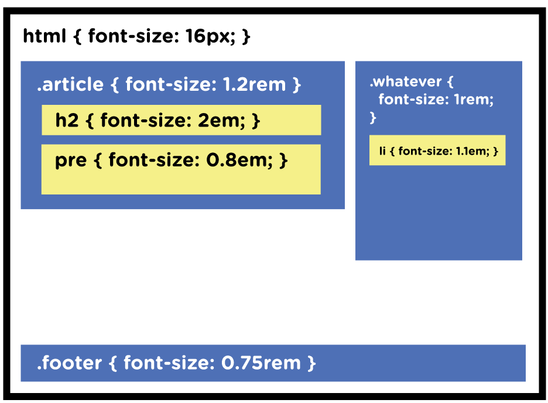
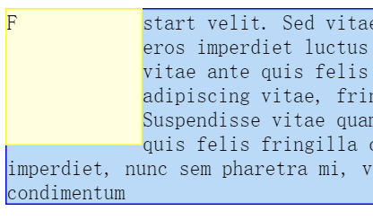
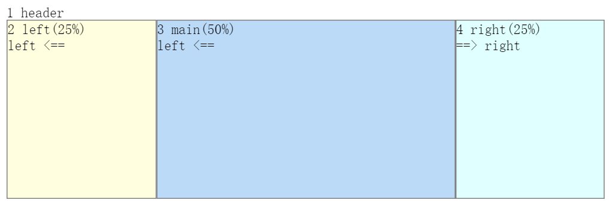
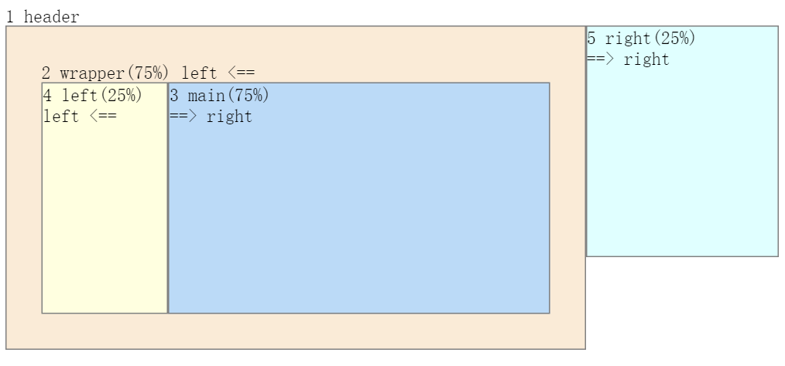
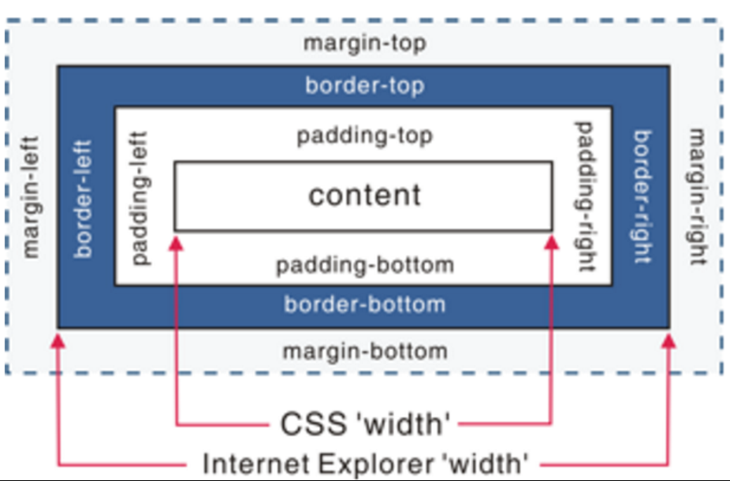

# cardaminexhz.github.io

* 背景图加载慢，如何解决 `background: url(back.jpg) repeat;`

***

* `px` `em` `rem`
    + Font Size Idea: `px` at the Root, `rem` for Components, `em` for Text Elements
    + `px` （pixel），相对于显示器的屏幕分辨率。
    + `em` 相对于当前对象内文本的字体尺寸。若未设置，则相对于浏览器的默认字体尺寸。
        任意浏览器的默认字体高：16px。  
        `1em = 16px` `12px = 0.75em`
    + `rem` （root em，根em），是css3新增的一个相对单位。   
        使用 rem 设置字体大小时，相对的是html根元素。  
        做到：只修改根元素，就可以成比例地调整多所有字体大小。
    
    > While em is relative to the font-size of its direct or nearest parent, rem is only relative to the html (root) font-size.
    
    
    
        /* Document level adjustments */
        html {
          font-size: 16px;
        }
        @media (max-width: 900px) {
          html { font-size: 15px; }
        }
        @media (max-width: 400px) {
          html { font-size: 13px; }
        }
        
        /* Modules will scale with document */
        .header {
          font-size: 1.5rem;
        }
        .footer {
          font-size: 0.75rem;
        }
        .sidebar {
          font-size: 0.85rem;
        }
        
        /* Type will scale with modules */
        h1 {
          font-size: 3em;
        }
        h2 {
          font-size: 2.5em;
        }
        h3 {
          font-size: 2em;
        }
        
    ref:  
    [Font Size Idea: px at the Root, rem for Components, em for Text Elements](https://css-tricks.com/rems-ems/)

***

* 概览 布局的类型
    + 固定宽度
        - 当下趋势：智能手机 / 平板 / 桌面浏览器，屏宽多种多样
    + 流式：根据 browser 窗口大小伸缩
        - 最大限度地利用了窗口空间
        - 但在超宽显示器上可能宽的可笑：文本行也会很长，不方便阅读
        - `%`
    + 响应式 Responsive Web Design
        - 根据不同的浏览器宽度，来改变展现效果（创建不同布局）
        - e.g. 桌面型显示器：超宽多列布局 <-> 智能手机：单列布局
        - CSS 媒体查询 `media queries`

* HTML5 分区元素
    + 语义化标签【TODO】
    + `
` 出于样式的考虑，用来给内容分组

* CSS 布局
    + float 用于绝大多数网页的布局（符合网页的流动本质）
    + 绝对定位 适合于小任务，e.g. 将logo定位到特殊位置
    + 其他：（？）
        - multicolumn 长文本-》多个并排的列
        - flex box：垂直/ 水平/ 不同方向、顺序排列（多浏览器支持）
        - grid （未支持）

* 布局策略
    + 内容优先：内容决定设计
    + Mobile First
    + 先设计草图 -> 找出方框 -> html（更契合的html标签 | `
`）+css
    + 顺应页面流
    + 添加图片的两种方式：
        - ``
        - `background-image`
            * 适用于一些场景：图片上放置文字
            * 缺：不能被打印出来；也不被spider搜索
    + 元素层次 `position`
    
    ***

* 基于浮动的布局 `float`
    + `float` 场景
        - 可创建环绕效果
        - 作用于 `
` 又是布局工具
    + 属性
        - left | right
        - none：用来取消元素中已经应用的浮动
    + 源代码的顺序
        - 使用浮动时，源代码的顺序很重要：浮动元素必须处在要包围它的元素之前。
        - 浮动一个元素F时，只有其后的元素会包围上来，挨着F显示。
        - 其后的元素，会环绕着F（文本环绕），而其背景色和边框会在F的底层延伸。
        
    
    ***
    
    + 为什么浮动元素会凸出其包围块（溢出）【TODO】
    + 如何避免浮动元素溢出 | 清除浮动【TODO】
        - cleat
        - 使父元素成为BFC
        
    + 关于 `zoom`
        - 仅 IE 支持，不影响其他浏览器
        - 能触发 IE6/7 中的布局，来修正 IE 中的bugs
    
    ***
    
    + 在浮动元素里浮动元素
    
    利用不同的浮动方法，可以轻松改变 HTML 的源码顺序。
    
    场景：响应式布局时，可能需要将主体部分优先显示（需要 main 的源码在前）
    
    
    
    
    
    ***
    
    + 浮动下落 float drop
        - 原因：空间不够，容纳不下所有的列（浏览器为元素计算实际屏幕宽度时的古怪方式）
    + 盒模型（以 宽 为例）
    
        - 
        
        - 标准盒模型：
        
            width 只是 content 的宽度，元素宽 = width + 2*(padding + border + margin)    
            e.g. 如果 .box {width: 350px}; 而且 {border: 10px solid black;} 那么在浏览器中的渲染的实际宽度将是370px;
        - IE 怪异模式（Quirks mode）：
        
            width 包含 content | padding | border，不包含 margin，元素宽 = width + 2*margin   
            e.g. box {width: 350px; border: 10px solid black;} 浏览器渲染出的宽度将是350px. 如果计算后的最内部的内容宽度为负值，都会被计算成0，内容还在，所以不可能通过border-box来隐藏元素。
    + 浮动下落 解决：
        + 算术计算
        + `box-sizing` 
            - content-box：width 只包含 content（默认值）
            - padding-box：width 包含 content | padding（只有 firefox 支持）
            - border-box： width 包含 content | padding | border（使算数计算简单，在遇到某些常见需求时更容易实现效果）
              
                    /* 通用选择器 */
                    * {
                        -moz-box-sizing: border-box;
                        box-sizing: border-box;
                    }
    
***
 
+ 混合流式布局 + 固定宽度
    - `%`
    - max-width 代替 width，弹性设计：既能适应不同的浏览器窗口；在超宽显示器上因为不会超过max-witdh，也不会难以阅读
    - 水平居中：`margin: 0 auto;`
        * `margin: 0 auto` 失效场景
            1. 未给要居中的元素设置宽度
            2. 对浮动元素失效

***

* 响应式 web 设计 responsive web design
    + 使网页能根据浏览器屏幕宽度来改变布局
    + 实现：
        1. 布局：弹性网格（智能手机尺寸五花八门，应让网页能伸展/收缩：流式布局理念）
        2. 图片、视频：弹性媒体
        3. 为不同屏幕宽度（分辨率/高度/方向）创建不同样式：CSS 媒体查询
    + 手机浏览器会自动根据屏幕大小来缩小页面
        - 并不好：文本缩小，难以阅读
        - 如何忽略手机浏览器的这种行为：
            1. `<meta name="viewport" content="width=device-width">`
                * `meta` 提供网页内容的其他信息；额外只是浏览器如何显示此网页
                * `viewport` 浏览器屏幕
                * `width=device-width` 将浏览器屏幕宽度设为手机屏幕宽度
            2. 主样式表，所有样式之前 `@viewport {width: device-width;}`
                * 优：不必给每个 html 添加 `<meta>`
                * 缺：并非所有浏览器都支持，需前缀
* CSS 媒体查询
    + 定制设计
        - 智能手机 | 平板电脑 | 桌面浏览器
        - 目标：使网页在各种宽度的屏幕上都很美观
        - 手段：测试不同的设计 & 屏幕宽度：一个4列的设计什么时候需要变成2列/ 1列
    + 常见的变更
        - 调整列，e.g. desktop 4列；landscape 2/3列；phone 单列，不再使用浮动
        - 弹性宽度，e.g. desktop (`max-width + %`)；landscape, phone (`auto | 100%`)
        - 紧缩空白空间，e.g. landscape, phone 缩小 `padding | margin` 以放下更多内容
        - 调整字号，e.g. phone 需要更大字号（结合 `px` `rem` `em`）
        - 导航
        - （必要时）隐藏内容
        - 背景图片 class + background-image 代替 ``，为不同设备加载不同大小的照片
    + 创建断点 breakpoint
        - <= 480px
        - 480px ~ 768px
        - 大于等于 769px
        - 从哪个值的位置开始断开：断点/ 最佳尺寸
    + 策略
    
        先从默认设计开始（即没有媒体查询就能生效的设计），之后再创建媒体查询样式来调整/ 修饰。
        
        不需要给每种设备分别创建3组完整的样式。
        
        所以，desktop 优先？mobile phone 优先？
        
    + 媒体查询，询问 browser
        1. `<link rel="stylesheet" type="text/css" href="styles.css" media="(width: 480px)">`
            - `media="(width: 480px)"` 设定条件，符合条件的 browser 才能使用该样式
            - 范围值 `(max-width: 480px)` `(min-width: 480px) and (max-width: 768px)` `(min-width: 769px)` 
        2. `@import url(css/small.css) (max-width: 480px)`
        3. 放在主样式表后
        
                /* for landscape */
                @media (min-width: 481px) and (max-width: 900px) {
                    aside {
                        padding-right: 0;
                    }
                }
    + 其他：
        - 根据 desktop 优先 | mobile phone 优先，确定 html 源码顺序
        - 固定宽度 -> 弹性网格：计算 `%`