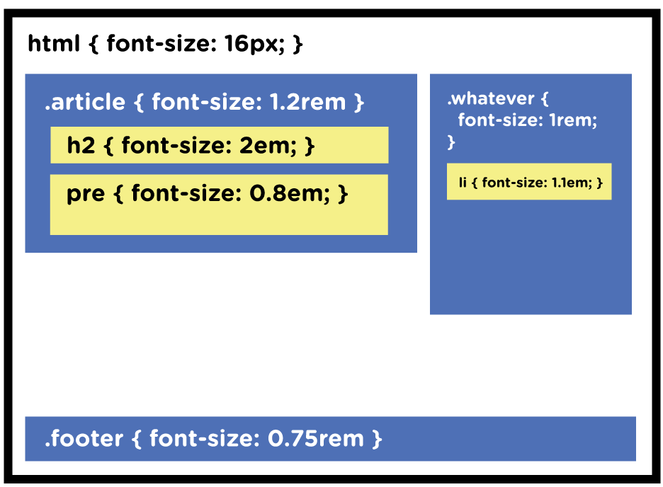

# cardaminexhz.github.io

* 背景

***

* `px` `em` `rem`
    + Font Size Idea: `px` at the Root, `rem` for Components, `em` for Text Elements
    + `px` （pixel），相对于显示器的屏幕分辨率。
    + `em` 相对于当前对象内文本的字体尺寸。若未设置，则相对于浏览器的默认字体尺寸。
        任意浏览器的默认字体高：16px。  
        `1em = 16px` `12px = 0.75em`
    + `rem` （root em，根em），是css3新增的一个相对单位。   
        使用 rem 设置字体大小时，相对的是html根元素。  
        做到：只修改根元素，就可以成比例地调整多所有字体大小。
    
    > While em is relative to the font-size of its direct or nearest parent, rem is only relative to the html (root) font-size.
    
    
    
        /* Document level adjustments */
        html {
          font-size: 16px;
        }
        @media (max-width: 900px) {
          html { font-size: 15px; }
        }
        @media (max-width: 400px) {
          html { font-size: 13px; }
        }
        
        /* Modules will scale with document */
        .header {
          font-size: 1.5rem;
        }
        .footer {
          font-size: 0.75rem;
        }
        .sidebar {
          font-size: 0.85rem;
        }
        
        /* Type will scale with modules */
        h1 {
          font-size: 3em;
        }
        h2 {
          font-size: 2.5em;
        }
        h3 {
          font-size: 2em;
        }

***

* 背景图加载慢，如何解决 `background: url(back.jpg) repeat;

***

ref:  
[Font Size Idea: px at the Root, rem for Components, em for Text Elements](https://css-tricks.com/rems-ems/)
