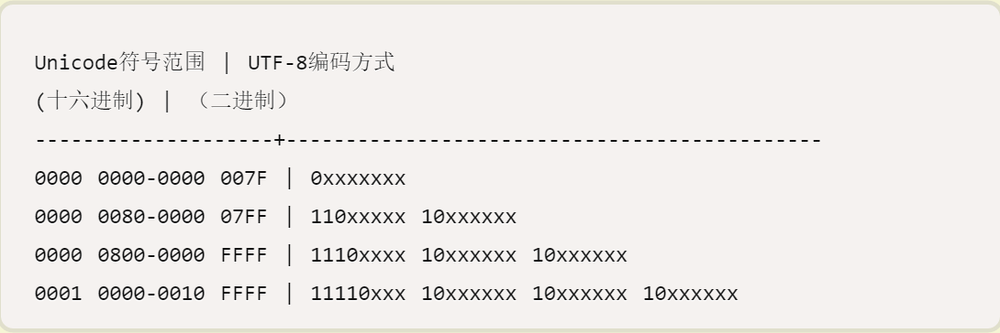
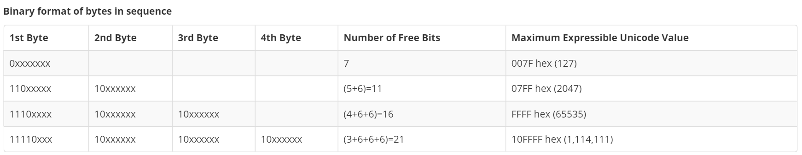

<h3>任务目的</h3>
<ul>
    <li>加强对JavaScript的掌握</li>
    <li>熟悉常用表单处理逻辑</li>
</ul>

<h3>任务描述</h3>
<ul>
    <li>如<a target="_blank" href="http://7xrp04.com1.z0.glb.clouddn.com/task_2_29_1.jpg">示例图</a>中所示，在页面中实现一个输入框与按钮，要求点击验证按钮后，对输入框中内容进行格式校验，并在其下方显示校验结果</li>
    <li>
        校验规则：
        <ul>
            <li>1.字符数为4~16位</li>
            <li>2.每个英文字母、数字、英文符号长度为1</li>
            <li>3.每个汉字，中文符号长度为2</li>
        </ul>
    </li>
</ul>

<h3>任务注意事项</h3>
<ul>
    <li>要求功能实现与任务描述中完全一致</li>
    <li>示例图仅为参考，样式不需要完全实现一致</li>
    <li>请注意代码风格的整齐、优雅</li>
    <li>代码中含有必要的注释</li>
    <li>不允许借助任何第三方组件库实现</li>
</ul>

<h3>任务协作建议</h3>
<ul>
    <li>团队集中讨论，明确题目要求，保证队伍各自对题目要求认知一致</li>
    <li>各自完成任务实践</li>
    <li>交叉互相Review其他人的代码，建议每个人至少看一个同组队友的代码</li>
    <li>相互讨论，最后合成一份组内最佳代码进行提交</li>
</ul>

<h3>在线学习参考资料</h3>
<ul>
    <li><a target="_blank" href="https://www.zhihu.com/question/22689579">Web相关名词通俗解释</a></li>
    <li><a target="_blank" href="https://developer.mozilla.org/zh-CN/docs/Web/Guide/HTML/Introduction">MDN HTML入门</a></li>
    <li><a target="_blank" href="http://www.imooc.com/learn/9">慕课HTML+CSS基础教程视频</a></li>
    <li><a target="_blank" href="http://www.w3school.com.cn/js/js_form_validation.asp">JavaScript 表单验证</a></li>
    <li><a target="_blank" href="https://developer.mozilla.org/zh-CN/docs/Web/Guide/HTML/Forms">HTML表单指南</a></li>
</ul>

***

* 字符长度计算
    + 每个英文字母、数字、英文符号长度为1
    + 每个汉字，中文符号长度为2
* 思路
    + 遍历字符串，英文字母 etc. 长度+1；汉字 etc. 长度+2；
        - 如何区分英文字母 / 汉字？
        - `charCodeAt(index)` 返回指定位置的字符的 Unicode 编码
        - 【后补】既然 `UTF-8` 只是 `Unicode` 的一种实现方式（定义怎么存储），那么这里要区分 中/英文字符，只需要关注他们的二进制编码，也就是 `Unicode`.
        - 正则
        - 问题来了：它们的 `Unicode` 编码分别是多少？`UTF-8 V.S. Unicode`? `UTF-8`中哪些是英文字母/字符？哪些是汉字/中文字符？
    + 把双字节的替换成两个单字节的然后再获得长度
* 背景知识
    + `Unicode` 符号集：规定 character 的二进制编码
        - 但没有规定二进制编码的存储方式
        - 怎么知道三个字节表示一个字符还是三个字符？对于用一个字节就可以完整表示的字符（e.g.英文字符），用几个字节来表示？
        - 造成：`Unicode` 有多种存储方式
    + `UTF-8`：`Unicode` 的一种存储方式
        - 变长的编码方式：最小编码单位(code unit)为1个字节，可以用1-4个字节来表示字符，根据不同的字符来变换字节长度  
        （赞！节省存储空间。怎么就默默地想起来变长指令集了呢o(╯□╰)o）
        - 先来看看[阮一峰](http://www.ruanyifeng.com/blog/2007/10/ascii_unicode_and_utf-8.html)的总结：
        
        > 1）对于单字节的符号，字节的第一位设为0，后面7位为这个符号的unicode码。因此对于英语字母，UTF-8编码和ASCII码是相同的。    
          2）对于n字节的符号（n>1），第一个字节的前n位都设为1，第n+1位设为0，后面字节的前两位一律设为10。剩下的没有提及的二进制位，全部为这个符号的unicode码。  
              
            如果一个字节的第一位是0，则这个字节单独就是一个字符；  
            如果第一位是1，则连续有多少个1，就表示当前字符占用多少个字节。
            
        - 再看一个 [UTF-8 Encoding](http://www.fileformat.info/info/unicode/utf8.htm)
            
    + `ASCII`: 单字节编码系统 [ref](http://www.asciima.com/)
        - ASCII非打印控制字符  
            0～31及127(共33个)是控制字符或通信专用字符（其余为可显示字符），    
            如控制符：LF（换行）、CR（回车）、FF（换页）、DEL（删除）、BS（退格)、BEL（响铃）等;   
            ASCII值为8、9、10 和13 分别转换为退格、制表、换行和回车字符。 
        - ASCII打印字符：能在键盘上找到的字符 32-126    
            32是空格,  
            48～57为0到9十个阿拉伯数字  
            65～90为26个大写英文字母  
            97～122号为26个小写英文字母   
            同时还要注意，在标准ASCII中，其最高位(b7)用作奇偶校验位。
        - 扩展ASCII打印字符   
            扩展ASCII码允许将每个字符的第8位用于确定附加的128个特殊符号字符、外来语字母和图形符号。
        
 * 解决
    + [Phoebe-Perry](https://github.com/Phoebe-Perry/ife_baidu_2016/blob/gh-pages/second_phase/ife-baidu_task_29/task_29.html): 
    利用 `Unicode` 编码 - `charCodeAt()`，0-128，长度+1；其他，长度+2；
    
            function countLength(str) {
                var inputLength = 0;
                for (var i = 0; i < str.length; i++) {
                    var countCode = str.charCodeAt(i);
                    if (countCode >= 0 && countCode <=128) {
                        inputLength += 1;
                    } else {
                        inputLength += 2;
                    }
                }
                return inputLength;
            }
    + 正则：十六进制`Unicode`码 `\u0000`:`\uffff`
        
            function getLength(str) {
                return str.replace(/[^\u0000-\u00ff]/g,"01").length;
            }
    + 正则：十六进制`ASCII`码 `\x00`:`\xff`
    
            function getLength(str) {
                return str.replace(/[^\x00-\xff]/g,"01").length;
            }
* ref
    + 大端/小端：[程序员趣味读物：谈谈Unicode编码](http://www.pconline.com.cn/pcedu/empolder/gj/other/0505/616631.html)
    
        > `big endian` 和 `little endian` 是CPU处理多字节数的不同方式。  
          例如“汉”字的Unicode编码是6C49。那么写到文件里时，究竟是将6C写在前面，还是将49写在前面？如果将6C写在前面，就是`big endian`。还是将49写在前面，就是`little endian`。  
          “endian”这个词出自《格列佛游记》。小人国的内战就源于吃鸡蛋时是究竟从大头(Big-Endian)敲开还是从小头(Little-Endian)敲开，由此曾发生过六次叛乱，其中一个皇帝送了命，另一个丢了王位。  
          我们一般将 `endian` 翻译成“字节序”，将 `big endian` 和 `little endian` 称作“大尾”和“小尾”。
      
    + 为什么会有 `Unicode`: [encoding](http://info.lionbridge.com/rs/lionbridge/images/Lionbridge%20FAQ_encoding_2013.pdf)
        大意是 `ASCII`（单字节编码） 能表示的字符有限，对英文这样的语言适用，但中文系的（象形）语言就表示不过来。于是有 `Unicode` 这样的多字节编码。其中中文这样的亚洲象形文字称为 `JCR`.
           
***

* 点击按钮出现一个类似边框的东西？
    + [为什么会出现](http://zhidao.baidu.com/question/331807657.html?fr=qrl&index=0&qbl=topic_question_0&word=css%20outline)  
        当元素获得焦点的时候，焦点框为0.
        比如说当前这个网页，你用tab键切换的时候，文字链接、搜索框、按钮等的外面会有一个虚线框（或高亮框），此时当前的元素就获得了焦点，你可以对它进行操作。
        这个功能一般是为使用键盘操作的用户准备的。
        有些链接——比如一个图片链接，你不想让他出现虚线框破坏设计感，就可以用此方法。
        
        建议一般不要去掉，只在一些影响设计美感的地方用。毕竟这个焦点框对键盘用户是很有帮助的。
    + `outline` V.S. `border`
    
            selector {
                outline: color style width;
            }
        1. outline是不占空间的，既不会增加额外的width或者height
        2. outline有可能是非矩形的
    + 怎么去掉
    
            selector:focus { outline: 0; }