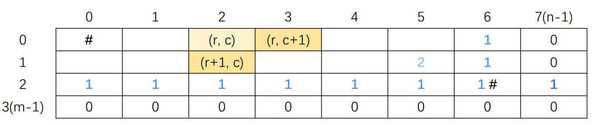

# 62. Unique Paths

[62. Unique Paths](https://leetcode.com/problems/unique-paths/)

A robot is located at the top-left corner of a m x n grid (marked &#39;Start&#39; in the diagram below).

The robot can only move either down or right at any point in time. The robot is trying to reach the bottom-right corner of the grid (marked &#39;Finish&#39; in the diagram below).

How many possible unique paths are there?

Above is a 3 x 7 grid. How many possible unique paths are there?

Note: m and n will be at most 100.

***

* 思路：
    + recursion 见[demo.js](https://github.com/cardaminexhz/cardaminexhz.github.io/blob/master/practiceDemo/algorithms/leetcode/62-Unique%20Paths/demo.js)
    + DP - top down
    + DP - bottom up
        
        
        见[demo.js](https://github.com/cardaminexhz/cardaminexhz.github.io/blob/master/practiceDemo/algorithms/leetcode/62-Unique%20Paths/DP-memorization.js)
    + 组合数学
        见[demo.js](https://github.com/cardaminexhz/cardaminexhz.github.io/blob/master/practiceDemo/algorithms/leetcode/62-Unique%20Paths/combinatorics.js)
    
    