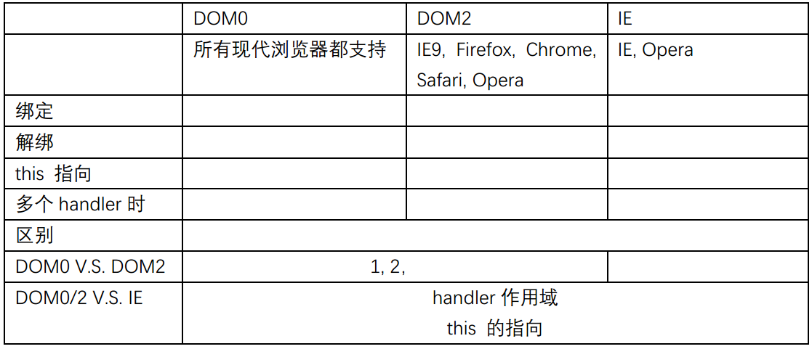

# 松耦合，观察者模式，events

* Observer pattern [观察者模式](https://en.wikipedia.org/wiki/Observer_pattern)
    

***

* Custom events

    ref: [Custom events in JavaScript](https://www.nczonline.net/blog/2010/03/09/custom-events-in-javascript/)

    + 最小功能集
        1. `Assign` an event handler for a particular event.
        2. `Remove` an event handler for a particular event.
        3. `Fire` an event and call all assigned event handlers.
    + 思路
        - 创建一个类：实现最小功能集；然后创建一个类的实例，或者子类继承该类，创建子类的实例。
        
                function EventTarget () {
                }
                EventTarget.prototype = {
                    assign: function() {},
                    remove: function() {},
                    fire: function() {}
                }
        - `Assign` `Remove` `Fire` 函数的外层作用域创建一个对象，存储注册的事件及响应函数列表。
        
                this._listeners = {
                    type1 : [handler11, handler12, handler13],
                    type2 : [handler21, handler22, handler23],
                    ...
                }
        - `Assign`(或者说`bind`)时，若该类型尚无响应函数，则创建一个数组；若已存在，直接将新的响应函数push到数组。
        
                if(typeof this._listeners[type] == 'undefined') {
                    this._listeners[type] = [];
                }
                this._listeners[type].push(handler);
        - `Fire`(或者说`trigger`)时，依次调用该类型的响应函数即可。
        
                var handlers = this._listeners[event.type];
                for(var i = 0; i < handlers.length; i++) {
                    handlers[i].call(this, event);
                }
    + [源码，来自上述博客](https://github.com/cardaminexhz/cardaminexhz.github.io/tree/master/practiceDemo/event/event model/demo.js)
    + 增强：【TODO】
        - 事件冒泡
        - 出错后继续执行handler
        - 允许handler阻止进一步操作或和默认行为
        - 比如触发响应函数时的上下文应该是什么，
        触发响应函数的参数列表应该是什么，如果要求把调用trigger的参数列表都传到响应函数中还要考虑到吧arguments对象转化为纯数组才行等等。

***

* 事件相关点整理 

    [1,2,3,4 here](https://github.com/cardaminexhz/cardaminexhz.github.io/tree/master/practiceDemo/event) | [5 here](https://github.com/cardaminexhz/cardaminexhz.github.io/tree/master/baiduProj/task30) | 6 见上文
    
1. 事件流：从页面中接收事件的顺序；`IE` `W3C(DOM2级)` 
2. 事件处理程序的区别 `DOM0/2` `IE`
    
3. 事件对象的区别 `DOM` `IE`
4. 跨浏览器的事件处理程序 | 事件对象 （最小功能集）
    
        var EventUtil = {
            addListener: ...,
            removeListener: ...,
            
            getEvent: ...,
            getTarget: ...,

            preventDefault: ...,
            stopPropagation: ...
        }
5. 事件委托；原理，优缺点；原生JS实现事件委托，兼容浏览器
6. 原生JS实现事件模型
7. 模拟事件；事件如何派发？【TODO】
