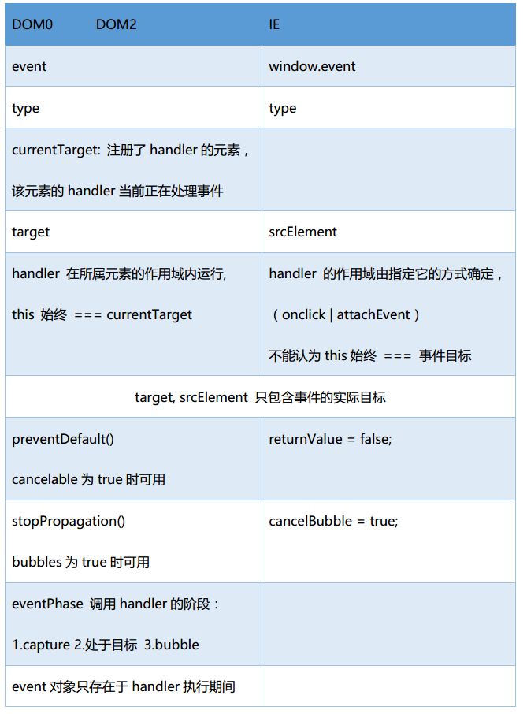

# 事件

* 事件
    + 事件（eventName）：动作 `click` `load` `mouseover`
    + 事件处理程序（event handler）：`onclick` `onload` 
    
***

* 事件流 - 描述从页面中接收事件的顺序
    + 事件冒泡（event bubbling）
    
                           / \
            ---------------| |-----------------
            | element1     | |                |
            |   -----------| |-----------     |
            |   |element2  | |          |     |
            |   -------------------------     |
            |        Event BUBBLING           |
            -----------------------------------
    + 事件捕获（event capturing）
                
                           | |
            ---------------| |-----------------
            | element1     | |                |
            |   -----------| |-----------     |
            |   |element2  \ /          |     |
            |   -------------------------     |
            |        Event CAPTURING          |
            -----------------------------------
    + W3C 模型：首先进入捕获阶段，到达目标元素，再进入冒泡阶段
    
                             | |  / \
            -----------------| |--| |-----------------
            | element1       | |  | |                |
            |   -------------| |--| |-----------     |
            |   |element2    \ /  | |          |     |
            |   --------------------------------     |
            |        W3C event model                 |
            ------------------------------------------
    
***

* HTML 事件处理程序

        <input type="button" value="click me" onclick="showMsg()" >
    + 时差：html元素出现在界面上时，handler 可能还未准备好，引发错误
    + HTML 与 JS 紧耦合，不推荐
    
***

* JS事件处理程序 
    + DOM0 级 `onclick`
            
                var btn = document.getElementById("xx-btn");
                btn.onclick = function() {
                    console.log(this.id);       <!-- xx-btn -->
                }
                
                btn.onclick = null;             <!-- 删除 handler -->
        - 将一个函数赋值给一个事件处理程序属性，在冒泡阶段处理
        - 每个元素（包括window, document）都有自己的事件处理程序属性，通常全部小写 `onclick`
        - 这个handler被认为是元素的方法：`this -> 当前元素`
        - 只能定义一个 handler：定义多个时，以后一个为准
    + DOM2 级 `addEventListener`
    
                btn.addEventListener("click", function(){
                    console.log(this.id);       <!-- xx-btn -->
                }, false)
        - `elem.addEventListener(event, handler, boolean)` 
        - boolean: true-在捕获阶段处理；false-在冒泡阶段处理
        - event: `click` `mouseover`
        - 相较于 DOM0 级，优点：
            1. 可指定在捕获阶段 / 冒泡阶段处理
            2. 可为一个元素添加多个handler，按添加顺序触发
        - 删除handler:   
        通过 `addEventListener()` 添加的handler，只能通过 `removeEventListener()` 来移除；且参数必须一致。所以当 handler 为匿名函数时无法移除。
    + IE 事件处理程序 （IE Opera 支持）
        
                btn.attachEvent("onclick", function(){
                    console.log(this === window);       <!-- true -->
                })
        - `elem.attachEvent(event, handler)` 添加到冒泡阶段；
        - event: `onclick`  （V.S. DOM2）
        - 注意 `handler 的作用域`
            1. 使用 `attachEvent()`，handler 在全局作用域中运行，`this -> window`
            2. 对DOM0/2，handler 在所属元素的作用域内运行，`this -> 所属元素（currentTarget）`
        - 可为一个元素添加多个handler，按添加顺序的`相反顺序`触发（V.S. DOM2）
        - 删除handler:
        通过 `attachEvent()` 添加的handler，只能通过 `detachEvent()` 来移除；且参数必须一致。所以当 handler 为匿名函数时无法移除。

多数情况，将handler添加到事件流的冒泡阶段，以最大程度地兼容各种浏览器；  
添加到捕获阶段：最好只在需要在事件到达目标之前截获它的时候。
        
***

* 总结：  
    
    
    + preventDefault()
        e.g. 阻止链接的默认行为（被单击时，跳转到其href指定的url）
    + stopPropagation()
        e.g. 立即停止事件在DOM层次中的传播，来取消进一步的事件冒泡/捕获
* 一个兼容（DOM0/ DOM2/ IE）的事件处理程序

        var EventUtil = {
            addHandler: function(element, type, handler) {
                if(element.addEventListener) {
                    element.addEventListener(type, handler, false);
                } else if(element.attachEvent()) {
                    element.attachEvent(type, handler);
                } else {
                    element["on"+type] = handler;
                }
            },

            removeHandler: function(element, type, handler) {
                if(element.removeEventListener) {
                    element.removeEventListener(type, handler, false);
                } else if(element.detachEvent) {
                    element.detachEvent(type, handler);
                } else {
                    element["on"+type] = null;  <!-- 方括号语法，可支持动态构建属性名 -->
                }
            },

            getEvent: function(event) {
                return event ? event : window.event;
            },
            
            getTarget: function (event) {
                return event.target || event.srcElement;
            },
            
            preventDefault: function (event) {
                if(event.preventDefault) {
                    event.preventDefault();
                } else {
                    event.returnValue = false;
                }
            },
            
            stopPropagation: function (event) {
                if(event.stopPropagation) {
                    event.stopPropagation();
                } else {
                    event.cancelBubble = true;
                }
            }

        };

***

[事件2：事件委托 / 事件模拟](https://github.com/cardaminexhz/cardaminexhz.github.io/tree/master/baiduProj/task30)

***

ref:  
高级程序设计  
[生动详细解释javascript的冒泡和捕获](http://blog.jobbole.com/39446/)
