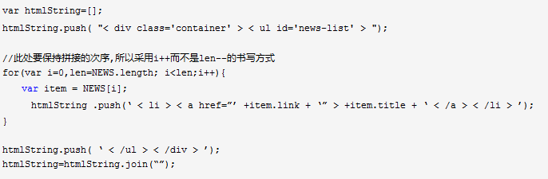

# 9-20 几道笔试题

* 提高连接字符串操作的效率
    
    
    
    
    
    + 对不同浏览器：
        - 在大多数浏览器中，数组项合并比其他字符串连接更慢，推荐使用简单的 `+` `+=`。
        - 但在IE7及之前版本，数组项合并`join`是合并大量字符串唯一高效的途径。

* 求数组的交集
    + `e.g. arr1 = [1,2,3,3,4,2,3,5]; arr2 = [3,4,4,3,5,7,8];`
    + T(n) = o(n); S(n) = o(n);
        见[demo.js](https://github.com/cardaminexhz/cardaminexhz.github.io/tree/master/practiceDemo/interview/9-20/demo.js)