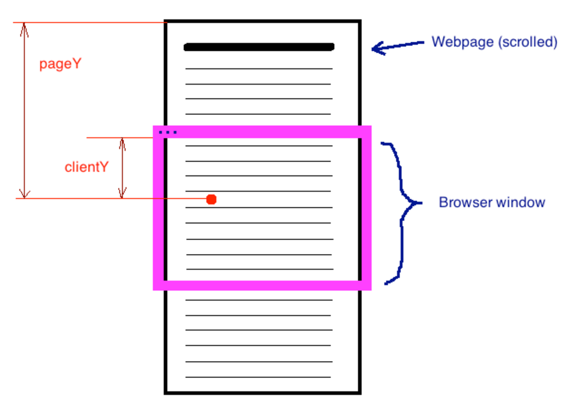

# 拖放

* 拖放的概念
    + 创建一个绝对定位的元素，用鼠标移动。
    + handler 的处理
    + 修缮拖拽
        问题：元素的左上角总是和鼠标在一起
        - 鼠标事件的几个概念：   
            1. 客户区坐标 `event.clientX` `clientY`   
                事件发生时，mouse在 `视口` 中的水平/ 垂直坐标；
                不包含页面滚动的距离，不代表mouse在页面上的位置；
            2. 页面坐标 `event.pageX` `pageY`    
                事件发生时，mouse在 `页面` 中的位置；
                页面没有发生滚动时，clientX === pageX；
            3. 屏幕坐标 `event.screenX` `screenY`   
                相对于 `屏幕`，（而非浏览器窗口）
            
            
        - HTMLElement offsetLeft
            1. `HTMLElement.offsetParent` 是一个只读属性，返回一个指向最近的（closest，指包含层级上的最近）包含该元素的定位元素。
            如果没有定位的元素，则 offsetParent 为最近的 table 元素对象或根元素（标准模式下为 html；quirks 模式下为 body）。当元素的 style.display 设置为 "none" 时，offsetParent 返回 null。offsetParent 很有用，因为 offsetTop 和 offsetLeft 都是相对于其内边距边界的
            2.  `HTMLElement.offsetLeft` 是一个只读属性，返回当前元素左上角相对于 `HTMLElement.offsetParent` 节点的左边界偏移的像素值。  
                对块级元素来说，offsetTop、offsetLeft、offsetWidth 及 offsetHeight 描述了元素相对于 offsetParent 的边界框。
         
  
***

ref:  
[What is the difference between screenX/Y, clientX/Y and pageX/Y?](http://stackoverflow.com/questions/6073505/what-is-the-difference-between-screenx-y-clientx-y-and-pagex-y)
