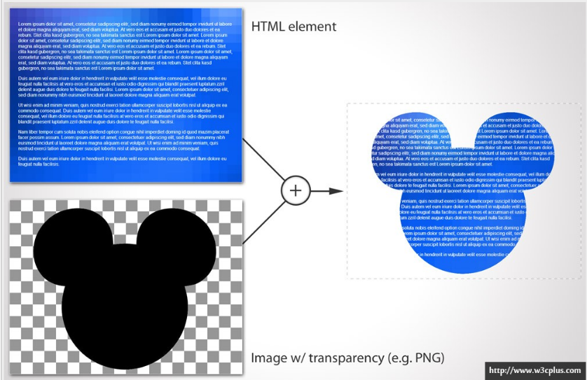

# 遮罩效果

* 用超大 border 实现外部填充 `mask.html`

    1. 绝对定位，利用border-radius来实现圆形 `border-redius: 50%;`
    2. 用超大的border来实现外部的填充，
        
            border: 20000px solid black;
            margin-left: -20000px;
            margin-top: -20000px;
            
    3. 调整border的透明度达到需要的透明度，
    
            opacity:0.9;              /* 透明度 */
            filter:Alpha(opacity=90); /* IE8 以及更早的浏览器 */
            -moz-opacity:0.9;
    
    4. 父级定位元素 `overflow: hidden;`

***

* CSS3 mask `mask-css3.html`

　　　　CSS3 提供了 mask-img 来实现遮罩。mask 的原理是使用一张遮罩用图片，遮罩图片中的黑色代表显示，白色代表隐藏。
　　　　`background: url(img/background.jpg) repeat;`
　　　　`-webkit-mask: url(img/mask.png);`

>　图像是由rgb三个通道以及在每个像素上定义的颜色组成的。但是在他们之上还有第四个通道，alpha通道，通过亮度定义每个像素上的透明度。
白色意味着不透明，黑色意味着透明，介于黑白之间的灰色表示半透明。

 
 
 ref: [如何在CSS中使用遮罩](http://www.w3cplus.com/css3/css-masking.htmlm/)
       
***

* 添加动画效果 `mask-transition.html`

    1. clip: `clip: rect(100px,200px,300px,50px);` 
       定义一个剪裁矩形，用来剪裁绝对定位元素；
       允许规定一个元素的可见尺寸，这样此元素就会被修剪并显示为这个形状；
       出了这个剪裁区域的内容会根据 overflow 的值来处理；
       剪裁区域可能比元素的内容区大，也可能比内容区小。
    2. transition 一个简写属性，用来设置4个过渡属性。
        * transition-property	规定设置过渡效果的 CSS 属性的名称。
        * transition-duration	规定完成过渡效果需要多少秒或毫秒。
        * transition-timing-function	规定速度效果的速度曲线。
        * transition-delay	定义过渡效果何时开始
        
在 `mask-transition.html` 中，实现遮罩效果的思路：

1. 用超大 border 实现外部填充
2. `:hover` 时，增大透明圆形的 `width` 和 `height`
3. 通过 `transition` 加上一个过渡动画效果
4. demo 可以看这里 [say Hi](http://cardaminexhz.github.io/practiceDemo/tools-mask/mask-transition.html/) 文字通过 `:hover::after` 添加。

***
