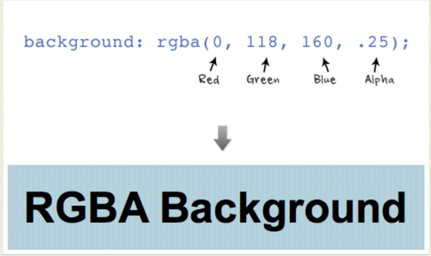

# 遮罩效果

* 用超大 border 实现外部填充 `mask.html`

    1. 绝对定位，利用border-radius来实现圆形 `border-redius: 50%;`
    2. 用超大的border来实现外部的填充，
        
            border: 20000px solid black;
            margin-left: -20000px;
            margin-top: -20000px;
            
    3. 调整border的透明度达到需要的透明度，
    
            opacity:0.9;              /* 透明度 */
            filter:Alpha(opacity=90); /* IE8 以及更早的浏览器 */
            -moz-opacity:0.9;
    
    4. 父级定位元素 `overflow: hidden;`

***

* CSS3 mask `mask-css3.html`

CSS3 提供了 mask-img 来实现遮罩。mask 的原理是使用一张遮罩用图片，遮罩图片中的黑色代表显示，白色代表隐藏。

    background: url(img/background.jpg) repeat;
    -webkit-mask: url(img/mask.png);

>　图像是由rgb三个通道以及在每个像素上定义的颜色组成的。但是在他们之上还有第四个通道，alpha通道，通过亮度定义每个像素上的透明度。
白色意味着不透明，黑色意味着透明，介于黑白之间的灰色表示半透明。  
`The first three values are RGB color values and the last value is the level of the transparency (0 = transparent and 1 = opaque).`

 
 
 
  ref:  
  [如何在CSS中使用遮罩](http://www.w3cplus.com/css3/css-masking.html/)  
  [The Basics of CSS3](http://webdesignerwall.com/tutorials/the-basics-of-css3/)
       
***

* 添加动画效果 `mask-transition.html`

    1. clip: `clip: rect(100px,200px,300px,50px);` 
       定义一个剪裁矩形，用来剪裁绝对定位元素；
       允许规定一个元素的可见尺寸，这样此元素就会被修剪并显示为这个形状；
       出了这个剪裁区域的内容会根据 overflow 的值来处理；
       剪裁区域可能比元素的内容区大，也可能比内容区小。
        
在 `mask-transition.html` 中，实现遮罩效果的思路：

1. 用超大 border 实现外部填充
2. `:hover` 时，增大透明圆形的 `width` 和 `height`
3. 通过 `transition` 加上一个过渡动画效果
4. demo 可以看这里 [say Hi](http://cardaminexhz.github.io/practiceDemo/tools-mask/mask-transition.html) 文字通过 `:hover::after` 添加。

***

* transition

1. transition 是什么 - 在一定时间内，将一组css属性 `变换` 到另一组属性的 `动画展示过程`。
2. 如何使 transition 生效
    + 两个样式：最初，最终。然后浏览器负责以动画形式展示两个样式之间的变化过程。
    + transition 属性：一般定义在最初样式中。
    + 触发器：促使样式发生变化（最初 -> 最终）的执行动作。
        - 伪类触发：e.g. `:hover`（鼠标悬浮在元素上时），`:active`（鼠标单击元素时），`:target`（元素成为链接目标时）。
        - 通过JS动态改变标签样式：1.改变 `className`；2.修改 `.style.xxxproperty`
        
            应用场景：需要在点击元素时启动 transition；当有鼠标悬停在一个元素上时，在另一个元素上触发 transition；etc.
        - 总之，只要有 css属性发生变化，css transition 都会生效。
        
        当不再触发执行动作时（如鼠标离开），浏览器会将该标签返回到它的前一个样式，并以动画显示整个过程。
        样式变化（最初 < - > 最终），只需设置一次 transition。
        【问】通过JS动态改变标签样式时，并未自动回到最初状态？       
3. 可以以动画形式模拟哪些css属性
    + `height` `width` `margin` `padding`
    + `top` `left` `bottom` `right` （定位属性）
    + `color` `background-color` `opacity`
    + `border-color` `border-width`
    + `font-size` `line-height` `letter-spacing` `word-spacing`      
4. 如何添加 transition
    + transition-property	以过渡效果展示哪些属性
      如果使用all关键字或者省略了transition-property，那么所有发生变化的属性都会应用transition；如果使用none关键字，则不会有transition效果
    + transition-duration	完成过渡效果需要多少秒或毫秒。
    + transition-timing-function	规定速度效果的速度曲线。
    + transition-delay	过渡效果开始之前要不要延时        
5. 快捷方式

        transition: all 1s ease-in 5s;
        -webkit-transition: color 1s,      <!-- 确保在Firefox和Opera的旧版本中有效，使用供应商前缀 -->
                    background-color 1s,   <!-- 每个transition单独放一行，来提高可读性 -->
                    border-color .5s 1s;   <!-- border-colore 变化前有1s延时，即等其他属性展示完动画后，再启动动画 -->
        -moz-transition: color 1s,
                    background-color 1s,
                    border-color .5s 1s;
        -o-transition: color 1s,
                    background-color 1s,
                    border-color .5s 1s;

***

ref:  
[Web端遮罩效果实现探究](https://jdc.jd.com/archives/1535)   
[CSS3 Image Styles](http://webdesignerwall.com/demo/css3-image-styles/)

***

* 练习题-A块覆盖B块 `A-B-transmition.html`

> 遮罩效果 - 块a覆盖块b
    块a，块b等宽高（假设 width: 200px; height: 300px;）。
    当鼠标移入b中时，a慢慢地往下移，直到完全覆盖在b上面。
    a块只有和b重叠的部分才会显示在页面上（原本a从页面上看不见）
    
思路：

1. 定位

        <!-- html -->
        

            

        

        
        <!-- css -->
        .b {
            position: relative;
            overflow: hidden;    <!-- a块只有和b重叠的部分才会显示在页面上 -->
        }
        .a {
            position: absolute;
            top: -300px;
            transition: top 2s;
        }
2. 伪类：`当鼠标移入b中时，a慢慢地往下移`

        .b:hover .a{ top: 0; }
    怪不得说选择器是前端同学吃饭的家伙咯~
3. 动画操作 `top` 还是 `height`

    如上例，a, b等宽高，a相对b定位，初始时 `.a{ top: -300px; }`， 动画操作a的 `top`。   
    还尝试初始 `.a{ height: 0; top: 0; }`，动画操作a的 `height`，亦可实现；但当块ab含有文本节点时（并通过 `line-height` 来设置文字在竖直方向的位置），文本节点的显示效果不符合要求。
    